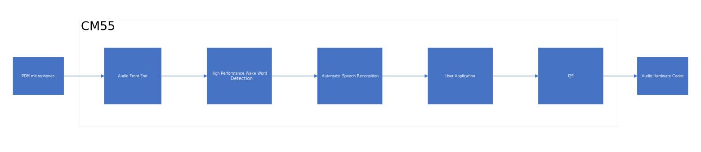
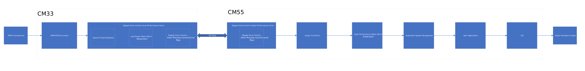

# PSOC&trade; Edge MCU: Local Voice 

This code example showcases Infineon’s comprehensive support for voice and audio applications on PSOC&trade; Edge MCU. Local Voice refers to the ability of PSOC&trade; Edge MCU to perform speech recognition, audio processing, inferencing and triggering actions locally at the edge, without relying on cloud connectivity or external servers. This code example supports the wake word "Ok Infineon/Okay Infineon" and a set of voice commands for music player application.

This code example has a three project structure - CM33 Secure, CM33 Non-Secure, and CM55 projects. All three projects are programmed to the external QSPI flash and executed in XIP mode. Critical codes are executed from SoCMem. Extended Boot launches the CM33 Secure project from a fixed location in the external flash , which then configures the protection settings and launches the CM33 Non-Secure application. Additionally, CM33 Non-Secure application enables CM55 CPU and launches the CM55 application.

This code example uses Peripheral Driver (PDL) libraries for peripherals such as PDM-PCM, LED, I2S and GPIO. The TLV310DAC3000 codec is used for playing audio data sent via I2S to the onboard loudspeaker.

> **Note:** 
>Refer to [Design Guide](docs/local_voice_design_guide.md) for the detailed description of this code example,its design,its various options and KPI details.  

> The Audio middleware components included in this code example has a time-limited operation of approx 15 mins. Users would need to contact Infineon for licensed unlimited version.

> The High Performance Core (CM55) inferencing is done by Infineon Tiny Speech Intelligence (ITSI) v1.2.5 library that uses both CM55 and U55. ITSI v1.2.5 is for close talk inferencing (1 feet from the PDM mic). So users must speak closer to the mic for successful inferencing of wake-word and commands.

> This Code Example also supports Sensory inferencing library which can be configured during compile time. This is supported only in Mains Powered Configuration. For Sensory, the talker must have US-accent/native accent for detections. Refer to [Design Guide](docs/local_voice_design_guide.md).

>This code example supports only Arm Compiler. The recommended version is 6.22. Users would need to download and install Arm Compiler separately from (https://developer.arm.com/downloads/view/ACOMPE)
Ensure to set the environment variable CY_COMPILER_ARM_DIR to point to the installation directory in PC.

## Overview

Infineon provides multiple voice and audio firmware components to enable local voice processing in PSOC&trade; Edge MCU. 

The voice and audio components are 

- PDM microphone control
- Staged Voice Control (SVC) 
- Speech Onset Detection (SOD)
- Low Power Wake Word Detection (LPWWD)
- Audio Front End (AFE)
- High Performance Wake Word Detection (HPWWD)
- Automatic Speech Recognition (ASR)
- I2S playback control

This code example uses PDM mics for capturing high-quality audio in a variety of environments. The PDM microphones offer a variety of benefits such as high sensitivity, low noise, and are resistant to electromagnetic interference (EMI).

This code example supports two configurations as listed below, 

**Mains powered local voice with PDM mic**: In this configuration, the audio pipeline runs entirely on the Arm&reg; Cortex&reg; M55 core as shown in  below Figure 1

   **Figure 1. Audio pipeline for mains powered local voice**

   

​
 **Battery powered local voice with PDM mic:** In this configuration, the audio pipeline runs on both Arm&reg; Cortex&reg; M33 and Arm&reg; Cortex&reg;  M55 cores as shown in Figure 2. This configuration is intended to be more power efficient and suitable for battery powered devices. However please note that this configuration can also be used for main powered applications as well.  
 

   **Figure 2: Audio pipeline for battery powered local voice**

   

The local voice code example can be used for various applications, such as home automation, smart speakers, voice assistants, automotive systems, etc. By processing voice commands locally, it provides faster response times, increased privacy, and improved reliability. Additionally, functionality can be extended to support multiple languages, dialects, and accents, making it more accessible to a wider range of users (depending on the inferencing library).

> Note: The PDM mic capture sampling rate is 16KHz. The I2S playback can be configured to one of the sampling rate from 16KHz, 44.1KHz, 48KHz sampling rate. In case of 44.1KHz, audio data is upsampled to 48KHz and played over I2S. The USB Audio Class TX/RX is also configured for 16KHz/Stereo.

## Requirements

- [ModusToolbox&trade; software](https://www.infineon.com/modustoolbox) v3.5 or later (tested with v3.5)
- ModusToolbox&trade; PSOC&trade; Edge E84 Early Access Pack. See [Software setup](#software-setup) for more details.
- Board support package (BSP) minimum required version for:
   - KIT_PSE84_EVAL_EPC2: v0.9.5
   - KIT_PSE84_EVAL_EPC4: v0.9.5
- Programming language: C
- Associated parts: All PSOC&trade; Edge E84 MCU parts

## Supported toolchains (make variable 'TOOLCHAIN')

- Arm&reg; compiler version 6.22 (`ARM`) - Default value of `TOOLCHAIN`

## Supported kits (make variable 'TARGET')

- **PSOC&trade; Edge E84 Evaluation Kit** (Minimum required revision: Rev *D)  
   - `KIT_PSE84_EVAL_EPC2`  
   - `KIT_PSE84_EVAL_EPC4` - Default value of `TARGET`  
   
## Hardware setup

This example uses the board's default configuration. See the kit user guide to ensure that the board is configured correctly.

Please ensure below jumper and pin configuration on board.
- Ensure BOOT SW should be in 'High'/ON position. 
- Ensure J20 and J21 should be in Tristate/Not-Connected (NC) position.

## Software setup

See the [ModusToolbox&trade; tools package installation guide](https://www.infineon.com/ModusToolboxInstallguide) for information about installing and configuring the tools package.  

<b>ModusToolbox&trade; PSOC&trade; Edge E84 Early Access Pack</b>

See _**AN235935** – Getting started with PSOC&trade; Edge E84 MCU on ModusToolbox&trade; software_ for detailed instructions on using the ModusToolbox&trade; Setup Program to install the PSOC&trade; Edge E84 Early Access Pack. A brief overview of the instructions is provided below.
 
1. Download and install the [ModusToolbox&trade; Setup Program](https://softwaretools.infineon.com/tools/com.ifx.tb.tool.modustoolboxsetup)
2. Run the ModusToolbox&trade; Setup Program and log in using your Infineon credentials. 
3. Select the “ModusToolbox&trade; PSOC&trade; Edge E84 Early Access Pack” under additional packages by clicking on the corresponding check box and click on `Next`. 
4. On the next dialog box, the packages which are ready to be installed are listed. You may access the 'Release Notes' and 'License' by clicking on the respective links. You may also choose a custom installation directory for Early Access Pack by clicking on 'Customize Installation'.
    > **Note:** The default installation directory of the Early Access pack is the root "ModusToolbox" installation directory of the respective operating system. 
    > **Note:** Do not exceed 120 characters for installation path of Early Access Pack in a non-default
    location in Windows operating system 
5. Select the check box to agree to the license and click on `Start`. The ModusToolbox&trade; PSOC&trade; Edge E84 Early Access Pack will be downloaded and installed. 
6. After installing the Early Access Pack, you can use the ModusToolbox&trade; Settings tool to enable the early access environment. The Settings tool (available from ModusToolbox&trade; v3.5 onwards) is a stand-alone tool and can be launched from other ModusToolbox&trade; tools such as Dashboard, BSP Assistant, Project Creator or Library Manager.  
Alternatively, you may also choose to add the following system variable manually. 
    > Variable name: <code>MTB_ENABLE_EARLY_ACCESS</code>  
    Variable value: <code>com.ifx.tb.tool.modustoolboxpackpsoce84</code>
7. Save the Environment variables and restart ModusToolbox&trade; software. 

Install a terminal emulator if you do not have one. Instructions in this document use [Tera Term](https://teratermproject.github.io/index-en.html).

This example requires Audacity Software and AFE Configurator Tool.

## Operation of the Code Example:

1. Connect the board to your PC using the provided USB cable through the KitProg3 USB connector. 
2. Open a terminal program and select the KitProg3 COM port. Set the serial port parameters to 8N1 and 115200 baud. 
3. Do the following settings in common.mk, set the type of configuration in the variable CONFIG_APP_PIPELINE.

**For Battery powered local voice configuration:** 

In common.mk, set `CONFIG_APP_PIPELINE=BATTERY_POWERED_LOCAL_VOICE` 

**For Mains powered local voice configuration:**

In common.mk, set `CONFIG_APP_PIPELINE=MAINS_POWERED_LOCAL_VOICE`

  
**Other related configurations:** 

In common.mk, ensure `CONFIG_INFERENCING_LIB` is set to `ITSI_M55_U55` or `SENSORY` If is is set to `DISABLED`, then inferencing will not happen in CM55. `SENSORY` is supported only in `CONFIG_APP_PIPELINE=MAINS_POWERED_LOCAL_VOICE`

In common.mk, set `CONFIG_VOICE_CORE_MODE=FULL` if the unlimited version of audio middleware is obtained from Infineon, else do not change it.

In common.mk, set `DEBUG_TUNING_MODE=DISABLED` to run the actual application. The remaining options for this variable are to be used for debug and tuning the audio pipeline which is discussed in Code Configurations section of this README.
 
Build the code.

Refer to [How to Build and Flash](docs/using_the_code_example.md).  

After programming, the application starts automatically.  

**Sequence of operation**
1. After board is bootup, say the wake word "Ok Infineon/Okay Infineon". On successful detection, red and green LEDs will glow.
In case of battery powered local voice configuration that uses both cores, red LED indicates low power wake word detection, green LED indicates high performance wake word reverification. 

2. After the red and green LEDs glow, say any of the supported commands. The supported commands are Play Music, Next Track, Previous Track, Increase Volume, Decrease Volume and Stop Music. 

3. On successful detection of commands, the blue LED will glow along with red and green LED.   

4. When the board is in music playback state, all 3 LEDs will continue to glow until Stop Music command is inferred.  

5. When the board is not in music playback state, commands such as Increase Volume, Decrease Volume will make the LEDs to go back to OFF once they are processed.  

6. Also monitor the UART terminal for the detection status. The UART terminal will print the detection results.  

7. The LED transitions are only for voice based activation and not for Push To Talk feature. For Push To Talk feature, press the USER BTN1, and directly speak the command. Its purpose is to bypass the wakeword.  
 > **Note:**
 > Push to Talk (PTT) feature is only supported for PDM mic input configurations. It is not enabled for USB input configurations. In case of Battery Powered configuration, PTT is not enabled during active music playback as there will be no wake word detection in CM33 core and it will require users to speak the wakeword for CM55 core to infer the commands. In case of Mains Powered configuration, PTT is enabled both during active music playback and listening states and command detection will happen if speech is detected.
Also PTT is not supported with Sensory inferencing engine.

## Design Guide:

Refer to [Design Guide](docs/local_voice_design_guide.md) for the detailed description of this code example,its design,its various options and KPI details.  

## Related resources

Resources  | Links
-----------|----------------------------------
Application notes  | **AN235935** – Getting started with PSOC&trade; Edge E84 MCU on ModusToolbox&trade; software

Code examples  | [Using ModusToolbox&trade; software](https://github.com/Infineon/Code-Examples-for-ModusToolbox-Software) on GitHub  
Device documentation | PSOC&trade; Edge E84 MCU datasheet  
Development kits | Select your kits from the [Evaluation board finder](https://www.infineon.com/cms/en/design-support/finder-selection-tools/product-finder/evaluation-board) page  
Libraries  | **mtb-device-support-pse8xxgp** – Device support library for PSE8XXGP ,  **retarget-io** – Utility library to retarget STDIO messages to a UART port  
Tools  | [ModusToolbox&trade; software](https://www.infineon.com/modustoolbox) – ModusToolbox&trade; software is a collection of easy-to-use software and tools enabling rapid development with Infineon MCUs, covering applications from embedded sense and control to wireless and cloud-connected systems using AIROC&trade; Wi-Fi and Bluetooth&reg; connectivity devices.  

## Other resources

Infineon provides a wealth of data at www.infineon.com to help you select the right device, and quickly and effectively integrate it into your design.

## Document history

Document title: *CE239456* - *PSOC&trade; Edge MCU: Local Voice*

 Version | Description of change
 ------- | ---------------------
 1.0.0   | New code example
 1.1.0   | Updated code example with AEC and 48KHz playback with Sampling Rate Conversion.
 1.2.0   | Added 44.1KHz playback support. Updated code example with ITSIv1.2 and ML based NS in AFE with support for ModusToolbox&trade; v3.3
 1.3.0   | Updated code example to support ModusToolbox&trade; v3.4   Updated to replace HAL with PDL API and to support libraries updated for the next major version of HAL   Renamed the supported BSP to KIT_PSE84_EVAL   Updated README   Updated to latest version of ITSI and audio algorithms   Updated to support the latest revision of PSOC&trade; Edge E84 MCU 
 1.4.0   | Updated code example with ITSI v1.2.5 official version, Sensory library and support ModusToolbox&trade; v3.5  

 

All referenced product or service names and trademarks are the property of their respective owners.

The Bluetooth&reg; word mark and logos are registered trademarks owned by Bluetooth SIG, Inc., and any use of such marks by Infineon is under license.

---------------------------------------------------------

© Cypress Semiconductor Corporation, 2023-2025. This document is the property of Cypress Semiconductor Corporation, an Infineon Technologies company, and its affiliates ("Cypress").  This document, including any software or firmware included or referenced in this document ("Software"), is owned by Cypress under the intellectual property laws and treaties of the United States and other countries worldwide.  Cypress reserves all rights under such laws and treaties and does not, except as specifically stated in this paragraph, grant any license under its patents, copyrights, trademarks, or other intellectual property rights.  If the Software is not accompanied by a license agreement and you do not otherwise have a written agreement with Cypress governing the use of the Software, then Cypress hereby grants you a personal, non-exclusive, nontransferable license (without the right to sublicense) (1) under its copyright rights in the Software (a) for Software provided in source code form, to modify and reproduce the Software solely for use with Cypress hardware products, only internally within your organization, and (b) to distribute the Software in binary code form externally to end users (either directly or indirectly through resellers and distributors), solely for use on Cypress hardware product units, and (2) under those claims of Cypress's patents that are infringed by the Software (as provided by Cypress, unmodified) to make, use, distribute, and import the Software solely for use with Cypress hardware products.  Any other use, reproduction, modification, translation, or compilation of the Software is prohibited.
 
TO THE EXTENT PERMITTED BY APPLICABLE LAW, CYPRESS MAKES NO WARRANTY OF ANY KIND, EXPRESS OR IMPLIED, WITH REGARD TO THIS DOCUMENT OR ANY SOFTWARE OR ACCOMPANYING HARDWARE, INCLUDING, BUT NOT LIMITED TO, THE IMPLIED WARRANTIES OF MERCHANTABILITY AND FITNESS FOR A PARTICULAR PURPOSE.  No computing device can be absolutely secure.  Therefore, despite security measures implemented in Cypress hardware or software products, Cypress shall have no liability arising out of any security breach, such as unauthorized access to or use of a Cypress product. CYPRESS DOES NOT REPRESENT, WARRANT, OR GUARANTEE THAT CYPRESS PRODUCTS, OR SYSTEMS CREATED USING CYPRESS PRODUCTS, WILL BE FREE FROM CORRUPTION, ATTACK, VIRUSES, INTERFERENCE, HACKING, DATA LOSS OR THEFT, OR OTHER SECURITY INTRUSION (collectively, "Security Breach").  Cypress disclaims any liability relating to any Security Breach, and you shall and hereby do release Cypress from any claim, damage, or other liability arising from any Security Breach.  In addition, the products described in these materials may contain design defects or errors known as errata which may cause the product to deviate from published specifications. To the extent permitted by applicable law, Cypress reserves the right to make changes to this document without further notice. Cypress does not assume any liability arising out of the application or use of any product or circuit described in this document. Any information provided in this document, including any sample design information or programming code, is provided only for reference purposes.  It is the responsibility of the user of this document to properly design, program, and test the functionality and safety of any application made of this information and any resulting product.  "High-Risk Device" means any device or system whose failure could cause personal injury, death, or property damage.  Examples of High-Risk Devices are weapons, nuclear installations, surgical implants, and other medical devices.  "Critical Component" means any component of a High-Risk Device whose failure to perform can be reasonably expected to cause, directly or indirectly, the failure of the High-Risk Device, or to affect its safety or effectiveness.  Cypress is not liable, in whole or in part, and you shall and hereby do release Cypress from any claim, damage, or other liability arising from any use of a Cypress product as a Critical Component in a High-Risk Device. You shall indemnify and hold Cypress, including its affiliates, and its directors, officers, employees, agents, distributors, and assigns harmless from and against all claims, costs, damages, and expenses, arising out of any claim, including claims for product liability, personal injury or death, or property damage arising from any use of a Cypress product as a Critical Component in a High-Risk Device. Cypress products are not intended or authorized for use as a Critical Component in any High-Risk Device except to the limited extent that (i) Cypress's published data sheet for the product explicitly states Cypress has qualified the product for use in a specific High-Risk Device, or (ii) Cypress has given you advance written authorization to use the product as a Critical Component in the specific High-Risk Device and you have signed a separate indemnification agreement.
 
Cypress, the Cypress logo, and combinations thereof, ModusToolbox, PSOC, CAPSENSE, EZ-USB, F-RAM, and TRAVEO are trademarks or registered trademarks of Cypress or a subsidiary of Cypress in the United States or in other countries. For a more complete list of Cypress trademarks, visit www.infineon.com. Other names and brands may be claimed as property of their respective owners.

