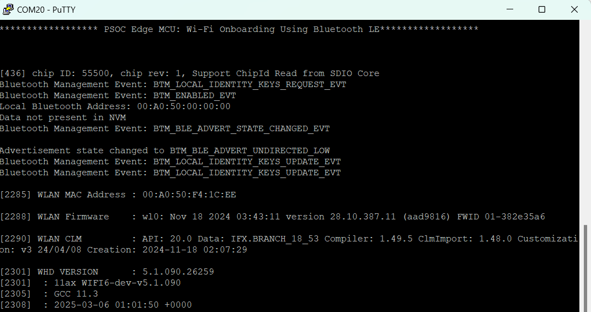
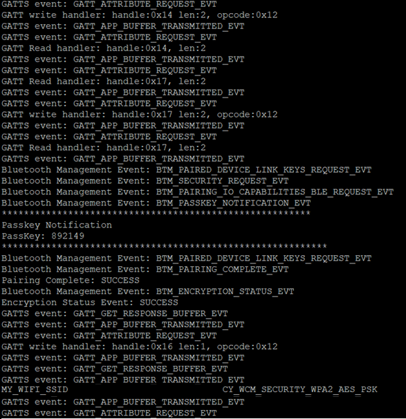
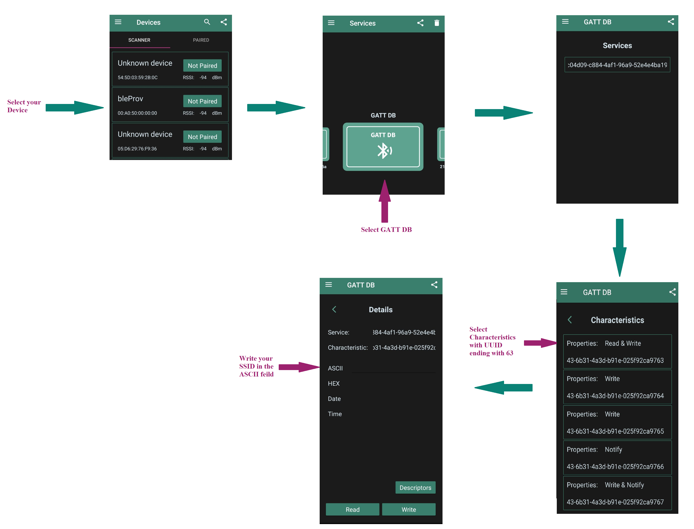
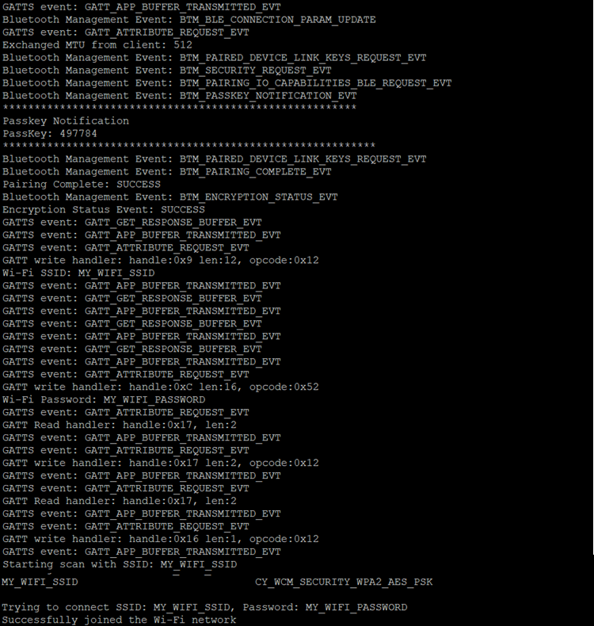

# PSOC&trade; Edge MCU: Wi-Fi Onboarding Using Bluetooth&reg; LE

This example uses the Arm&reg; Cortex&reg;-M33 CPU of PSOC&trade; Edge MCU to communicate with the AIROC™ CYW55513 combo devices and control the Wi-Fi and Bluetooth LE functionality. It uses Bluetooth LE on the combo device to help connect the Wi-Fi to the AP (Access Point).

Bluetooth LE provides a mechanism for the device to connect to a Wi-Fi AP by providing the Wi-Fi SSID (Service Set IDentifier) and password in a secure manner.The Wi-Fi SSID and password are exchanged using custom GATT service and characteristics.

This code example has a three project structure - CM33 Secure, CM33 Non-Secure, and CM55 projects. All three projects are programmed to the external QSPI flash and executed in XIP mode. Extended Boot launches the CM33 Secure project from a fixed location in the external flash, which then configures the protection settings and launches the CM33 Non-Secure application. Additionally, CM33 Non-Secure application enables CM55 CPU and launches the CM55 application.

See [Design and Implementation](docs/design_and_implementation.md) for the functional description of this code example. <br>

## Requirements

- [ModusToolbox&trade; software](https://www.infineon.com/modustoolbox) v3.5 or later (tested with v3.5)
- ModusToolbox&trade; PSOC&trade; Edge E84 Early Access Pack. See [Software setup](#software-setup) for more details.
- Board support package (BSP) minimum required version for:
   - KIT_PSE84_EVAL_EPC2: v0.9.5
   - KIT_PSE84_EVAL_EPC4: v0.9.5
- Programming language: C
- Associated parts: All PSOC&trade; Edge E84 MCU parts

## Supported toolchains (make variable 'TOOLCHAIN')

- GNU Arm&reg; embedded compiler v11.3.1 (`GCC_ARM`) - Default value of `TOOLCHAIN`
- Arm&reg; Compiler v6.22 (`ARM`)
- IAR C/C++ Compiler v9.50.2 (`IAR`)
- LLVM Embedded Toolchain for Arm&reg; v19.1.5 (`LLVM_ARM`)

## Supported kits (make variable 'TARGET')

- **PSOC&trade; Edge E84 Evaluation Kit** (Minimum required revision: Rev *D) <br>
   - `KIT_PSE84_EVAL_EPC2` - Default value of `TARGET` <br> 
   - `KIT_PSE84_EVAL_EPC4`

## Hardware setup

This example uses the board's default configuration. See the kit user guide to ensure that the board is configured correctly.

Please ensure below jumper and pin configuration on board.
- Ensure BOOT SW should be in 'High'/ON position. 
- Ensure J20 and J21 should be in Tristate/Not-Connected (NC) position.

## Software setup

See the [ModusToolbox&trade; tools package installation guide](https://www.infineon.com/ModusToolboxInstallguide) for information about installing and configuring the tools package. <br>

<details><summary><b>ModusToolbox&trade; PSOC&trade; Edge E84 Early Access Pack</b></summary>

See _**AN235935** – Getting started with PSOC&trade; Edge E84 MCU on ModusToolbox&trade; software_ for detailed instructions on using the ModusToolbox&trade; Setup Program to install the PSOC&trade; Edge E84 Early Access Pack. A brief overview of the instructions is provided below.
 
1. Download and install the [ModusToolbox&trade; Setup Program](https://softwaretools.infineon.com/tools/com.ifx.tb.tool.modustoolboxsetup)
2. Run the ModusToolbox&trade; Setup Program and log in using your Infineon credentials. 
3. Select the “ModusToolbox&trade; PSOC&trade; Edge E84 Early Access Pack” under additional packages by clicking on the corresponding check box and click on `Next`. 
4. On the next dialog box, the packages which are ready to be installed are listed. You may access the 'Release Notes' and 'License' by clicking on the respective links. You may also choose a custom installation directory for Early Access Pack by clicking on 'Customize Installation'.
    > **Note:** The default installation directory of the Early Access pack is the root "ModusToolbox" installation directory of the respective operating system.<br>
    > **Note:** Do not exceed 120 characters for installation path of Early Access Pack in a non-default
    location in Windows operating system<br>
5. Select the check box to agree to the license and click on `Start`. The ModusToolbox&trade; PSOC&trade; Edge E84 Early Access Pack will be downloaded and installed. 
6. After installing the Early Access Pack, you can use the ModusToolbox&trade; Settings tool to enable the early access environment. The Settings tool (available from ModusToolbox&trade; v3.5 onwards) is a stand-alone tool and can be launched from other ModusToolbox&trade; tools such as Dashboard, BSP Assistant, Project Creator or Library Manager. Alternatively, you may also choose to add the following system variable manually. 
    > Variable name: <code>MTB_ENABLE_EARLY_ACCESS</code> <br>
    Variable value: <code>com.ifx.tb.tool.modustoolboxpackpsoce84</code>
7. Save the Environment variables and restart ModusToolbox&trade; software. 

</details>

**Note:** This code example consists of two parts: a Bluetooth LE GAP Peripheral and a Bluetooth LE GAP Central.

For the Bluetooth LE GAP Central, download and install the AIROC&trade; Bluetooth&reg; Connect App for [iOS](https://apps.apple.com/in/app/airoc-bluetooth-connect-app/id6443702288) or [Android](https://play.google.com/store/apps/details?id=com.infineon.airocbluetoothconnect) or

Scan the following QR codes from your mobile phone to download the AIROC&trade; Bluetooth&reg; Connect App.


Install a terminal emulator if you do not have one. Instructions in this document use [Tera Term](https://teratermproject.github.io/index-en.html).

## Operation

See [Using the code example](docs/using_the_code_example.md) for instructions on creating a project, opening it in various supported IDEs, and performing tasks such as building, programming, and debugging the application within the respective IDEs.

1. Connect the board to your PC using the provided USB cable through the KitProg3 USB connector.

2. Open a terminal program and select the KitProg3 COM port. Set the serial port parameters to 8N1 and 115200 baud.

3. After programming, the application starts automatically. Observe the messages on the UART terminal, and wait for the device to initialize Bluetooth (BT) stack and Wi-Fi.

    The device initializes the Bluetooth (BT) stack and starts advertisement.


   **Figure 1. Boot-up Log**

   

4. Do the following to test using the AIROC&trade; Bluetooth&reg; Connect mobile app:
    
    1. Turn ON Bluetooth and location on your Android or iOS device.

    2. Launch the AIROC&trade; Bluetooth&reg; Connect app. 

    3. Press the reset switch (XRES) on the kit to start sending advertisements.

    4. Swipe down on the AIROC&trade; Bluetooth&reg; Connect app home screen to start scanning for Bluetooth LE Peripherals. Your device (“bleProv”) appears in the AIROC&trade; Bluetooth&reg; Connect app home screen. Select your device to establish a Bluetooth LE connection.

    5. Select the **GATT DB** Profile from the carousel view then select **Service**.

    6. To scan for the availabe Wi-Fi networks, enable the notifications in the characteristic with UUID ending in **66**, then select the characteristic with UUID ending in **67** and Select **Notify**. Write hex value 2 to this characterisitc (Pair/Pass key is printed in serial terminal,when app prompts enter pass/pair key). The device will start scanning and send the network details as notifications in the characteristic with UUID ending in 66. Terminal prints the Wi-Fi networks available as shown in Figure 2
      
       **Figure 2. Wi-Fi Scan results**
       
       

       **Note:** If the notifications are not enabled in the characteristic with UUID ending in 66 the scan will not be started as there is no way to report available networks to the user. The user can still connect to a network by entering WIFI SSID (in UUID ending with 63), Password (in UUID ending with 64) and then initiating the connect request by writing '1' in WIFI control chanracteristic (in UUID ending with 67).

    7. To connect to the Wi-Fi network you need to send SSID and password data to the client device. You can select one of the networks which was discovered during scan or you can give another set of details. If the given network is not available then the device will store the values and try to connect on next restart. Note that the data is stored in non-volatile storage only when the connect command is sent. There are two ways to send the WiFi credentials. Either send the WiFi SSID and password separately or together.

       1. Send SSID and password separately
           1. Select the characteristic with UUID ending in 63. Write your Wi-Fi SSID in hex or ASCII format.
           2. Select the characteristic with UUID ending in 64. Write your Wi-Fi password in hex or ASCII format.
       2. Send the SSID and password together
           1. Format the SSID and password data in TLV format. For SSID the type value is 1 and for password the type value is 2. The first byte of the data should be type and for this example it will be 1 for SSID followed by length of the SSID and then the SSID data which is in hex format. This is followed by TLV value for password. For e.g if the SSID is WIFISSID and password is PASSWORD then the formatted value will be:

           ```
           01 08 57 49 46 49 53 53 49 44 02 08 50 41 53 53 57 4f 52 44
           ```
           2. Select the characteristic with UUID ending in 65 in android app. Write your formatted SSID and password in hex tab

    8. If you are sending SSID and password separately then it is easier to input the data directly in the ASCII format. If you are sending them together then you have to use the hex format as the type and length values are in hex format.

       **Note:** You can use an online tool for converting the SSID and password from string to hex but be careful about where you type in your password.

       **Figure 3. AIROC&trade; Bluetooth&reg; Connect App Flow**
       
       

    9. Select the attribute with the UUID ending in **67**. Select **Notify** (if not already done earlier). Write hex value 1 to this characteristic to connect to the WiFi network. If the connection is successful then the server will send a notification with value 1 otherwise with value 0.

       **Figure 4. Connection Log**

       
      
5. Once the Wi-Fi SSID and password is provided by the client it is stored in the NVM. To delete this data the user needs to press User Button 1.

### Wi-Fi Throughput
This code example is configured to run on CM33 core at a frequency of 200 MHz, out of the external flash memory. However, this setup may result in lower throughput compared to running the code in internal memory (SRAM).
For optimal performance, it is recommended to run the code example on CM55 core at 400 MHz, leveraging the internal memory (i.e. System SRAM/SoCMEM). For guidance on achieving better throughput, refer to the README file of the Wi-Fi Bluetooth tester (mtb-psoc-edge-wifi-bluetooth-tester) application.

## Related resources

Resources  | Links
-----------|----------------------------------
Application notes  | **AN235935** – Getting started with PSOC&trade; Edge E84 MCU on ModusToolbox&trade; software <br/> **AN236697** - Getting started with PSOC&trade; MCU and AIROC&trade; Connectivity devices
Code examples  | [Using ModusToolbox&trade; software](https://github.com/Infineon/Code-Examples-for-ModusToolbox-Software) on GitHub 
Device documentation | PSOC&trade; Edge E84 MCU datasheet 
Development kits | Select your kits from the [Evaluation board finder](https://www.infineon.com/cms/en/design-support/finder-selection-tools/product-finder/evaluation-board) page
Libraries  | **mtb-device-support-pse8xxgp** – Device support library for PSE8XXGP <br /> **retarget-io** – Utility library to retarget STDIO messages to a UART port
Tools  | [ModusToolbox&trade; software](https://www.infineon.com/modustoolbox) – ModusToolbox&trade; software is a collection of easy-to-use software and tools enabling rapid development with Infineon MCUs, covering applications from embedded sense and control to wireless and cloud-connected systems using AIROC&trade; Wi-Fi and Bluetooth&reg; connectivity devices. <br />


## Other resources


Infineon provides a wealth of data at www.infineon.com to help you select the right device, and quickly and effectively integrate it into your design.


## Document history


Document title: *CE239536* - *PSOC&trade; Edge MCU: Wi-Fi Onboarding Using Bluetooth&reg; LE*

 Version | Description of change
 ------- | ---------------------
 1.0.0   | New code example
 1.1.0   | Updated code example to support ModusToolbox&trade; v3.2 <br> Updated secure project <br> Updated README
 1.2.0   | Updated code example to support ModusToolbox&trade; v3.3 <br> Updated secure project <br> Updated README
 1.3.0   | Updated code example to support ModusToolbox&trade; v3.5 <br> Updated to replace HAL with PDL API and to support libraries updated for the next major version of HAL <br> Added support for Arm&reg; Compiler v6.22,  LLVM Embedded Toolchain for Arm® v19.1.1 and IAR C/C++ Compiler v9.50.2 <br> Updated secure project <br>Updated README<br> Renamed the default supported BSP to `KIT_PSE84_EVAL_EPC2` <br> Added support for new BSP `KIT_PSE84_EVAL_EPC4`

All referenced product or service names and trademarks are the property of their respective owners.

The Bluetooth&reg; word mark and logos are registered trademarks owned by Bluetooth SIG, Inc., and any use of such marks by Infineon is under license.

---------------------------------------------------------

© Cypress Semiconductor Corporation, 2024-2025. This document is the property of Cypress Semiconductor Corporation, an Infineon Technologies company, and its affiliates ("Cypress").  This document, including any software or firmware included or referenced in this document ("Software"), is owned by Cypress under the intellectual property laws and treaties of the United States and other countries worldwide.  Cypress reserves all rights under such laws and treaties and does not, except as specifically stated in this paragraph, grant any license under its patents, copyrights, trademarks, or other intellectual property rights.  If the Software is not accompanied by a license agreement and you do not otherwise have a written agreement with Cypress governing the use of the Software, then Cypress hereby grants you a personal, non-exclusive, nontransferable license (without the right to sublicense) (1) under its copyright rights in the Software (a) for Software provided in source code form, to modify and reproduce the Software solely for use with Cypress hardware products, only internally within your organization, and (b) to distribute the Software in binary code form externally to end users (either directly or indirectly through resellers and distributors), solely for use on Cypress hardware product units, and (2) under those claims of Cypress's patents that are infringed by the Software (as provided by Cypress, unmodified) to make, use, distribute, and import the Software solely for use with Cypress hardware products.  Any other use, reproduction, modification, translation, or compilation of the Software is prohibited.
<br>
TO THE EXTENT PERMITTED BY APPLICABLE LAW, CYPRESS MAKES NO WARRANTY OF ANY KIND, EXPRESS OR IMPLIED, WITH REGARD TO THIS DOCUMENT OR ANY SOFTWARE OR ACCOMPANYING HARDWARE, INCLUDING, BUT NOT LIMITED TO, THE IMPLIED WARRANTIES OF MERCHANTABILITY AND FITNESS FOR A PARTICULAR PURPOSE.  No computing device can be absolutely secure.  Therefore, despite security measures implemented in Cypress hardware or software products, Cypress shall have no liability arising out of any security breach, such as unauthorized access to or use of a Cypress product. CYPRESS DOES NOT REPRESENT, WARRANT, OR GUARANTEE THAT CYPRESS PRODUCTS, OR SYSTEMS CREATED USING CYPRESS PRODUCTS, WILL BE FREE FROM CORRUPTION, ATTACK, VIRUSES, INTERFERENCE, HACKING, DATA LOSS OR THEFT, OR OTHER SECURITY INTRUSION (collectively, "Security Breach").  Cypress disclaims any liability relating to any Security Breach, and you shall and hereby do release Cypress from any claim, damage, or other liability arising from any Security Breach.  In addition, the products described in these materials may contain design defects or errors known as errata which may cause the product to deviate from published specifications. To the extent permitted by applicable law, Cypress reserves the right to make changes to this document without further notice. Cypress does not assume any liability arising out of the application or use of any product or circuit described in this document. Any information provided in this document, including any sample design information or programming code, is provided only for reference purposes.  It is the responsibility of the user of this document to properly design, program, and test the functionality and safety of any application made of this information and any resulting product.  "High-Risk Device" means any device or system whose failure could cause personal injury, death, or property damage.  Examples of High-Risk Devices are weapons, nuclear installations, surgical implants, and other medical devices.  "Critical Component" means any component of a High-Risk Device whose failure to perform can be reasonably expected to cause, directly or indirectly, the failure of the High-Risk Device, or to affect its safety or effectiveness.  Cypress is not liable, in whole or in part, and you shall and hereby do release Cypress from any claim, damage, or other liability arising from any use of a Cypress product as a Critical Component in a High-Risk Device. You shall indemnify and hold Cypress, including its affiliates, and its directors, officers, employees, agents, distributors, and assigns harmless from and against all claims, costs, damages, and expenses, arising out of any claim, including claims for product liability, personal injury or death, or property damage arising from any use of a Cypress product as a Critical Component in a High-Risk Device. Cypress products are not intended or authorized for use as a Critical Component in any High-Risk Device except to the limited extent that (i) Cypress's published data sheet for the product explicitly states Cypress has qualified the product for use in a specific High-Risk Device, or (ii) Cypress has given you advance written authorization to use the product as a Critical Component in the specific High-Risk Device and you have signed a separate indemnification agreement.
<br>
Cypress, the Cypress logo, and combinations thereof, ModusToolbox, PSOC, CAPSENSE, EZ-USB, F-RAM, and TRAVEO are trademarks or registered trademarks of Cypress or a subsidiary of Cypress in the United States or in other countries. For a more complete list of Cypress trademarks, visit www.infineon.com. Other names and brands may be claimed as property of their respective owners.


