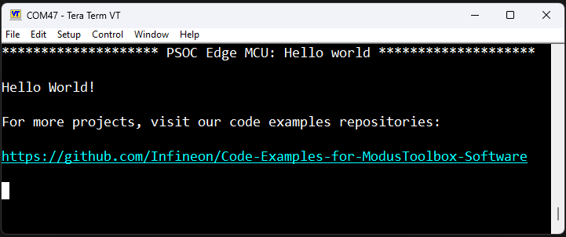

# PSOC&trade; Edge MCU: Hello world

This code example demonstrates a simple UART communication by printing the "Hello world" message on a terminal and blinking an LED using Arm&reg; Cortex&reg; M33 CPU on PSOC&trade; Edge MCU.

This code example has a three project structure - CM33 Secure, CM33 Non-Secure, and CM55 projects. All three projects are programmed to the external QSPI flash and executed in XIP mode. Extended Boot launches the CM33 Secure project from a fixed location in the external flash, which then configures the protection settings and launches the CM33 Non-Secure application. Additionally, CM33 Non-Secure application enables CM55 CPU and launches the CM55 application.

See [Design and Implementation](docs/design_and_implementation.md) for the functional description of this code example.  

## Requirements

- [ModusToolbox&trade; software](https://www.infineon.com/modustoolbox) v3.5 or later (tested with v3.5)
- ModusToolbox&trade; PSOC&trade; Edge E84 Early Access Pack. See [Software setup](#software-setup) for more details.
- Board support package (BSP) minimum required version for:
   - KIT_PSE84_EVAL_EPC2: v0.9.5
   - KIT_PSE84_EVAL_EPC4: v0.9.5
- Programming language: C
- Associated parts: All PSOC&trade; Edge E84 MCU parts

## Supported toolchains (make variable 'TOOLCHAIN')

- GNU Arm&reg; Embedded Compiler v11.3.1 (`GCC_ARM`) - Default value of `TOOLCHAIN`
- Arm&reg; Compiler v6.22 (`ARM`)
- IAR C/C++ Compiler v9.50.2 (`IAR`)
- LLVM Embedded Toolchain for Arm&reg; v19.1.5 (`LLVM_ARM`)

## Supported kits (make variable 'TARGET')

- **PSOC&trade; Edge E84 Evaluation Kit** (Minimum required revision: Rev *D)  
   - `KIT_PSE84_EVAL_EPC2` - Default value of `TARGET`   
   - `KIT_PSE84_EVAL_EPC4`

## Hardware setup

This example uses the board's default configuration. See the kit user guide to ensure that the board is configured correctly.

Please ensure below jumper and pin configuration on board.
- Ensure BOOT SW should be in 'High'/ON position. 
- Ensure J20 and J21 should be in Tristate/Not-Connected (NC) position.

## Software setup

See the [ModusToolbox&trade; tools package installation guide](https://www.infineon.com/ModusToolboxInstallguide) for information about installing and configuring the tools package.  

<b>ModusToolbox&trade; PSOC&trade; Edge E84 Early Access Pack</b>

See _**AN235935** – Getting started with PSOC&trade; Edge E84 MCU on ModusToolbox&trade; software_ for detailed instructions on using the ModusToolbox&trade; Setup Program to install the PSOC&trade; Edge E84 Early Access Pack. A brief overview of the instructions is provided below.
 
1. Download and install the [ModusToolbox&trade; Setup Program](https://softwaretools.infineon.com/tools/com.ifx.tb.tool.modustoolboxsetup)
2. Run the ModusToolbox&trade; Setup Program and log in using your Infineon credentials. 
3. Select the “ModusToolbox&trade; PSOC&trade; Edge E84 Early Access Pack” under additional packages by clicking on the corresponding check box and click on `Next`. 
4. On the next dialog box, the packages which are ready to be installed are listed. You may access the 'Release Notes' and 'License' by clicking on the respective links. You may also choose a custom installation directory for Early Access Pack by clicking on 'Customize Installation'.
    > **Note:** The default installation directory of the Early Access pack is the root "ModusToolbox" installation directory of the respective operating system. 
    > **Note:** Do not exceed 120 characters for installation path of Early Access Pack in a non-default
    location in Windows operating system 
5. Select the check box to agree to the license and click on `Start`. The ModusToolbox&trade; PSOC&trade; Edge E84 Early Access Pack will be downloaded and installed. 
6. After installing the Early Access Pack, you can use the ModusToolbox&trade; Settings tool to enable the early access environment. The Settings tool (available from ModusToolbox&trade; v3.5 onwards) is a stand-alone tool and can be launched from other ModusToolbox&trade; tools such as Dashboard, BSP Assistant, Project Creator or Library Manager.  
Alternatively, you may also choose to add the following system variable manually. 
    > Variable name: <code>MTB_ENABLE_EARLY_ACCESS</code>  
    Variable value: <code>com.ifx.tb.tool.modustoolboxpackpsoce84</code>
7. Save the Environment variables and restart ModusToolbox&trade; software. 

Install a terminal emulator if you do not have one. Instructions in this document use [Tera Term](https://teratermproject.github.io/index-en.html).

This example requires no additional software or tools.

## Operation

See [Using the code example](docs/using_the_code_example.md) for instructions on creating a project, opening it in various supported IDEs, and performing tasks such as building, programming, and debugging the application within the respective IDEs.

1. Connect the board to your PC using the provided USB cable through the KitProg3 USB connector.

2. Open a terminal program and select the KitProg3 COM port. Set the serial port parameters to 8N1 and 115200 baud.

3. After programming, the application starts automatically. Confirm that "PSOC Edge MCU: Hello world" is displayed on the UART terminal.

   **Figure 1. Terminal output on program startup**

   

4. Confirm that the kit LED blinks at approximately 1 Hz.

## Related resources

Resources  | Links
-----------|----------------------------------
Application notes  | **AN235935** – Getting started with PSOC&trade; Edge E84 MCU on ModusToolbox&trade; software
Code examples  | [Using ModusToolbox&trade; software](https://github.com/Infineon/Code-Examples-for-ModusToolbox-Software) on GitHub 
Device documentation | PSOC&trade; Edge E84 MCU datasheet 
Development kits | Select your kits from the [Evaluation board finder](https://www.infineon.com/cms/en/design-support/finder-selection-tools/product-finder/evaluation-board) page
Libraries  | **mtb-device-support-pse8xxgp** – Device support library for PSE8XXGP    **retarget-io** – Utility library to retarget STDIO messages to a UART port
Tools  | [ModusToolbox&trade; software](https://www.infineon.com/modustoolbox) – ModusToolbox&trade; software is a collection of easy-to-use software and tools enabling rapid development with Infineon MCUs, covering applications from embedded sense and control to wireless and cloud-connected systems using AIROC&trade; Wi-Fi and Bluetooth&reg; connectivity devices.  

## Other resources

Infineon provides a wealth of data at www.infineon.com to help you select the right device, and quickly and effectively integrate it into your design.

## Document history

Document title: *CE238541* - *PSOC&trade; Edge MCU: Hello world*

 Version | Description of change
 ------- | ---------------------
 1.0.0   | New code example
 1.1.0   | Updated secure project   Updated README
 1.2.0   | Updated secure project
 1.3.0   | Updated the secure project to enable boot from the external QSPI flash   Added support for Arm&reg; compiler
 1.4.0   | Updated code example to support ModusToolbox&trade; v3.2   Updated secure project   Updated README
 1.5.0   | Updated code example to support ModusToolbox&trade; v3.3   Updated secure project, Added IAR compiler support   Added support for newer version of Arm&reg; compiler v6.22  Updated README
 1.6.0   | Updated code example to support ModusToolbox&trade; v3.4   Updated to replace HAL with PDL API and to support libraries updated for the next major version of HAL   Renamed the supported BSP to `KIT_PSE84_EVAL`   Added support for LLVM Embedded Toolchain for Arm&reg; v19.1.1   Updated README
 1.7.0   | Updated code example to support ModusToolbox&trade; v3.5   Updated README   Added support for newer version of LLVM Embedded Toolchain for Arm&reg; v19.1.5   Updated secure project   Renamed the default supported BSP to `KIT_PSE84_EVAL_EPC2`   Added support for new BSP `KIT_PSE84_EVAL_EPC4`

 

All referenced product or service names and trademarks are the property of their respective owners.

The Bluetooth&reg; word mark and logos are registered trademarks owned by Bluetooth SIG, Inc., and any use of such marks by Infineon is under license.

---------------------------------------------------------

© Cypress Semiconductor Corporation, 2023-2025. This document is the property of Cypress Semiconductor Corporation, an Infineon Technologies company, and its affiliates ("Cypress").  This document, including any software or firmware included or referenced in this document ("Software"), is owned by Cypress under the intellectual property laws and treaties of the United States and other countries worldwide.  Cypress reserves all rights under such laws and treaties and does not, except as specifically stated in this paragraph, grant any license under its patents, copyrights, trademarks, or other intellectual property rights.  If the Software is not accompanied by a license agreement and you do not otherwise have a written agreement with Cypress governing the use of the Software, then Cypress hereby grants you a personal, non-exclusive, nontransferable license (without the right to sublicense) (1) under its copyright rights in the Software (a) for Software provided in source code form, to modify and reproduce the Software solely for use with Cypress hardware products, only internally within your organization, and (b) to distribute the Software in binary code form externally to end users (either directly or indirectly through resellers and distributors), solely for use on Cypress hardware product units, and (2) under those claims of Cypress's patents that are infringed by the Software (as provided by Cypress, unmodified) to make, use, distribute, and import the Software solely for use with Cypress hardware products.  Any other use, reproduction, modification, translation, or compilation of the Software is prohibited.
 
TO THE EXTENT PERMITTED BY APPLICABLE LAW, CYPRESS MAKES NO WARRANTY OF ANY KIND, EXPRESS OR IMPLIED, WITH REGARD TO THIS DOCUMENT OR ANY SOFTWARE OR ACCOMPANYING HARDWARE, INCLUDING, BUT NOT LIMITED TO, THE IMPLIED WARRANTIES OF MERCHANTABILITY AND FITNESS FOR A PARTICULAR PURPOSE.  No computing device can be absolutely secure.  Therefore, despite security measures implemented in Cypress hardware or software products, Cypress shall have no liability arising out of any security breach, such as unauthorized access to or use of a Cypress product. CYPRESS DOES NOT REPRESENT, WARRANT, OR GUARANTEE THAT CYPRESS PRODUCTS, OR SYSTEMS CREATED USING CYPRESS PRODUCTS, WILL BE FREE FROM CORRUPTION, ATTACK, VIRUSES, INTERFERENCE, HACKING, DATA LOSS OR THEFT, OR OTHER SECURITY INTRUSION (collectively, "Security Breach").  Cypress disclaims any liability relating to any Security Breach, and you shall and hereby do release Cypress from any claim, damage, or other liability arising from any Security Breach.  In addition, the products described in these materials may contain design defects or errors known as errata which may cause the product to deviate from published specifications. To the extent permitted by applicable law, Cypress reserves the right to make changes to this document without further notice. Cypress does not assume any liability arising out of the application or use of any product or circuit described in this document. Any information provided in this document, including any sample design information or programming code, is provided only for reference purposes.  It is the responsibility of the user of this document to properly design, program, and test the functionality and safety of any application made of this information and any resulting product.  "High-Risk Device" means any device or system whose failure could cause personal injury, death, or property damage.  Examples of High-Risk Devices are weapons, nuclear installations, surgical implants, and other medical devices.  "Critical Component" means any component of a High-Risk Device whose failure to perform can be reasonably expected to cause, directly or indirectly, the failure of the High-Risk Device, or to affect its safety or effectiveness.  Cypress is not liable, in whole or in part, and you shall and hereby do release Cypress from any claim, damage, or other liability arising from any use of a Cypress product as a Critical Component in a High-Risk Device. You shall indemnify and hold Cypress, including its affiliates, and its directors, officers, employees, agents, distributors, and assigns harmless from and against all claims, costs, damages, and expenses, arising out of any claim, including claims for product liability, personal injury or death, or property damage arising from any use of a Cypress product as a Critical Component in a High-Risk Device. Cypress products are not intended or authorized for use as a Critical Component in any High-Risk Device except to the limited extent that (i) Cypress's published data sheet for the product explicitly states Cypress has qualified the product for use in a specific High-Risk Device, or (ii) Cypress has given you advance written authorization to use the product as a Critical Component in the specific High-Risk Device and you have signed a separate indemnification agreement.
 
Cypress, the Cypress logo, and combinations thereof, ModusToolbox, PSOC, CAPSENSE, EZ-USB, F-RAM, and TRAVEO are trademarks or registered trademarks of Cypress or a subsidiary of Cypress in the United States or in other countries. For a more complete list of Cypress trademarks, visit www.infineon.com. Other names and brands may be claimed as property of their respective owners.