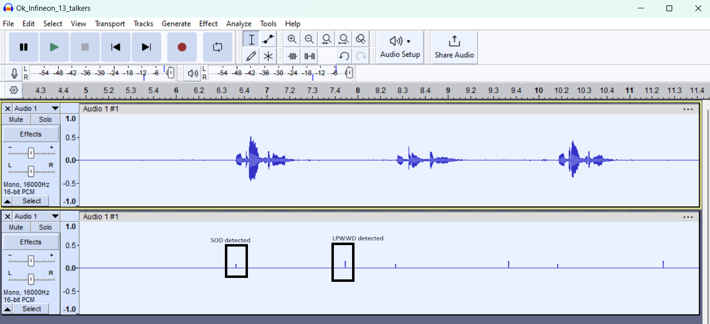
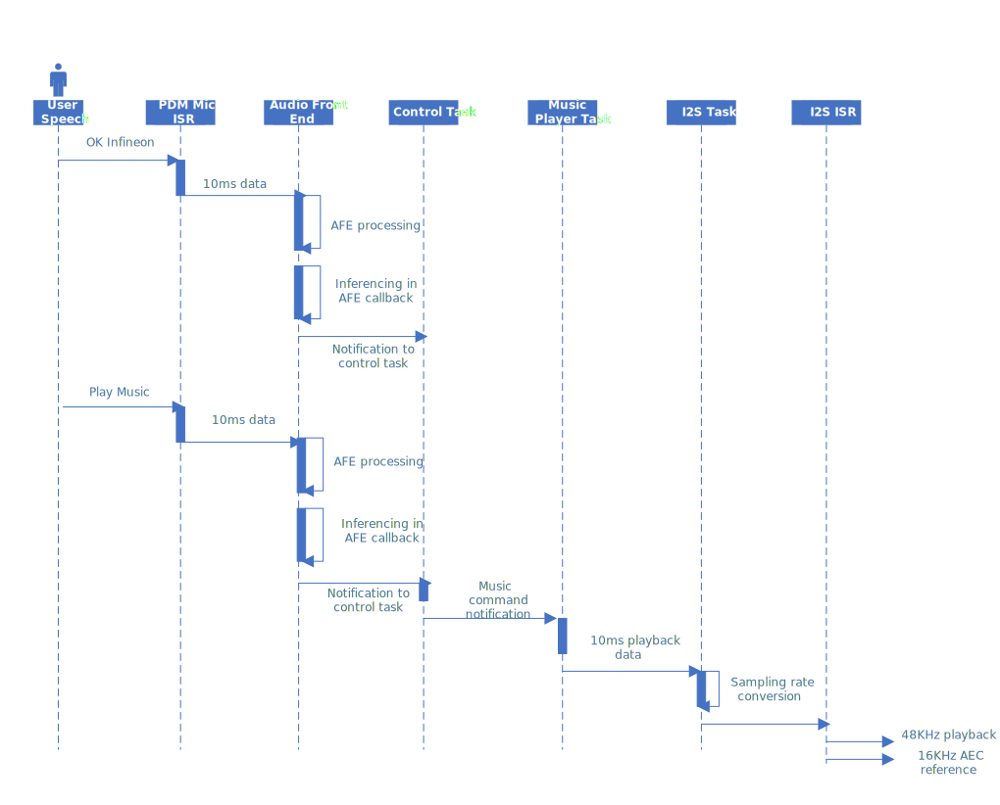
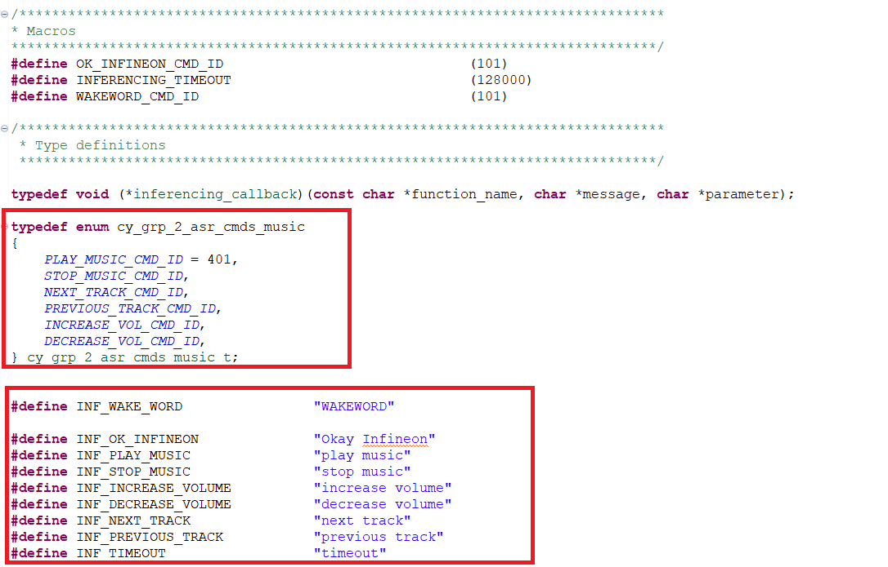

[Click here](../README.md) to view the README.

## Design and implementation

The design of this application is kept straightforward to help the user get started with code examples on PSOC&trade; Edge MCU devices. All PSOC&trade; Edge E84 MCU applications have a dual-CPU three-project structure to develop code for the CM33 and CM55 cores. The CM33 core has two separate projects for the Secure processing environment (SPE) and non-secure processing environment (NSPE). A project folder consists of various subfolders – each denoting a specific aspect of the project. The three project folders are as follows:

**Table 1. Application Projects**

Project | Description
--------|------------------------
proj_cm33_s | Project for CM33 Secure Processing Environment (SPE)
proj_cm33_ns | Project for CM33 Non-secure Processing Environment (NSPE)
proj_cm55 | CM55 Project

In this code example, at device reset, the secured boot process starts from the ROM boot in the Secured Enclave as the Root of Trust. From the Secured Enclave, the boot flow is passed on to the System CPU Subsystem where the secure CM33 application is first started. After all necessary secure configurations, the flow is passed on to the non-secure CM33 application. Resource initialization for this example is performed by this CM33 non-secure project. It configures the system clocks, pins, clock to peripheral connections, and other platform resources. It then enables the CM55 core using the Cy_SysEnableCM55() function.

Depending on the configuration in this code example, 

1. **Battery powered local voice with PDM mic:** 

   In the CM33 non-secure application running on Arm&reg; Cortex&reg; M33 core, the clocks and system resources are initialized by the BSP initialization function. The retarget-io middleware is configured to use the debug UART, and the user LEDs is initialized along with user button for PTT feature.

   In the CM55 application running on Arm&reg; Cortex&reg; M55 core, the clocks and system resources are initialized by the BSP initialization function. The retarget-io middleware is configured to use the debug UART.

   The debug UART prints a debug messages on the terminal emulator – the on-board KitProg3 acts the USB-UART bridge to create the virtual COM port. The debug prints from both the cores appear on the same UART.

   PDM mics are controlled via CM33 non-secure application and Staged Voice Control Middleware is initialized. 

   In CM33 non-secure application, Speech Onset Detection detects the presence of human speech in the PDM mic data and then triggers Low Power Wake Word Detection. Once wake word is detected, it is sent to Wake Word Detection engine on the CM55 application for reverification. 
   Once the wake word is reverified, then the spoken commands are streamed to CM55 application for inferencing and post processing which eventually results in playing pre-recorded audio via I2S on the onboard speakers. All the audio data pass through the Audio Front End for audio processing. Audio Front End, I2S control, High Performance inferencing run on Arm&reg; Cortex&reg; M55 core.

2. **Mains powered local voice with PDM mic:**

   In the CM33 non-secure application running on Arm&reg; Cortex&reg; M33 core, the clocks and system resources are initialized by the BSP initialization function. The retarget-io middleware is configured to use the debug UART.

   In the CM55 application running on Arm&reg; Cortex&reg; M55 core, the clocks and system resources are initialized by the BSP initialization function. The retarget-io middleware is configured to use the debug UART and the user LEDs are initialized.

   The entire audio pipeline runs on Arm&reg; Cortex&reg; M55 core. PDM mics are controlled by CM55 application.

   The audio frames from the PDM mic are fed into Audio Front End. The processed audio frames are then sent to the inferencing engine for wake word and command detections. Based on the inferred data, the required action is taken and pre-recorded audio data is played over I2S on the onboard speakers.

For both of the configurations, the audio pipeline from Audio Front End is similar.

Audio Front End has multiple software components. These components are:

- High Pass Filter
- Analysis
- Acoustic echo cancellation
- Beamforming
- Dereverberation
- Echo suppression
- Noise suppression
- Synthesis

The audio data flows through each component of the Audio Front End (AFE). The mic data is then filtered using a high-pass filter (HPF) to remove any low-frequency noise or interference. The AEC block uses a reference/playback audio data to cancel out any acoustic echoes.  The noise suppression component is used to reduce background noise and improve the clarity of the audio signal. Overall, the AFE components work together to enhance the quality of the audio signal and improve the inferencing performance.

The processed audio data is then passed to Infineon's ITSI library/Sensory library for wake word detection and automatic speech recognition. 


Table 2: Shows the Commands, Command ID and Actions for Music player application. 

**Table 2. Wake word and Automatic Speech Recognition commands - Music Player**

| Sr. No. | Wake word       | Command           | Command ID | Actions                                                      |
| ------- | --------------- | ----------------- | ---------- | ------------------------------------------------------------ |
| 1       | "Okay Infineon" |                   | 101        | Red and Green LED glow. Red indicates Low Power Wake Word Detection and Green indicates High Performance Wake Word Detection in case of battery powered configuration.                                      |
| 2       |                 | "Play Music"      | 401        | Blue LED glows in addition to Red and Green LED. Music will be played over onboard speaker. |
| 3       |                 | "Stop Music"      | 402        | Blue LED glows in addition to Red and Green LED. Music will be stopped.                  |
| 4       |                 | "Next Track"      | 403        | Blue LED glows in addition to Red and Green LED. Next audio track will be played over onboard speaker. |
| 5       |                 | "Previous Track"  | 404        | Blue LED glows in addition to Red and Green LED. Previous audio track will be played over onboard speaker. |
| 6       |                 | "Increase Volume" | 405        | Blue LED glows in addition to Red and Green LED. Volume of the playback is increased to a fixed value.    |
| 7       |                 | "Decrease Volume" | 406        | Blue LED glows in addition to Red and Green LED. Volume of the playback is decreased to a fixed value.    |

In Music player configuration, the 3 LEDs will glow when the music playback is on-going via "Start Music", "Next Track", "Previous Track" command. They will turn off only if "Stop Music" command is issued.
When music is playing, when Wake Word is uttered, music playback will be paused to listen to the commands. 
Music will not pause for Push To Talk feature. 


## Code Configurations

This code example has multiple configurations. They are,

**Application Configurations (Recommended Configurations for Development and Customizations):** <br>

The application configurations are the recommended settings for end user applications and customizations.

1. **Mains Powered Configuration with PDM mic input:** 

   To choose this configuration, set the following in common.mk

   ```
   CONFIG_APP_PIPELINE=MAINS_POWERED_LOCAL_VOICE
   DEBUG_TUNING_MODE=DISABLED
   ```

2. **Battery Powered Configuration with PDM mic input:**

   To choose this configuration, set the following in common.mk

   ```
   CONFIG_APP_PIPELINE=BATTERY_POWERED_LOCAL_VOICE
   DEBUG_TUNING_MODE=DISABLED
   ```

However, this code example also supports debug and tuning of the audio pipeline. Refer to the Tuning for KPI section in this README for setup information with USB Audio Class. The debug/tune configurations are
<br><br>

**Tuning Configurations (Only for Tuning and Debugging):**

1. **Mains Powered Configuration with PDM mic input and USB output of data:**

   In this configuration, the PDM mic data and AFE processed data are sent back to PC via two channel USB Audio Class that enumerates as stereo USB mic on the PC. Channel 1 is PDM mic data, and Channel 2 is AFE processed data. This configuration is useful for tuning the AFE components via AFE configurator.

   To choose this configuration, set the following in common.mk

   ```
   CONFIG_APP_PIPELINE=MAINS_POWERED_LOCAL_VOICE
   DEBUG_TUNING_MODE=PDM_MIC_IN
   ```
The tuning configurations are mainly for tuning and comparing the PDM mic capture and AFE processed data via USB.


2. **Mains Powered Configuration with USB audio input and USB output of data:**

   In this configuration, audio mic data can be sent via USB Audio Class from PC to the board. The audio mic data and AFE processed data are sent back to PC via USB Audio Class. Channel 1 is PDM mic data, and Channel 2 is AFE processed data. This configuration can be used to validate the performance of the inferencing engine with a standard file based audio input and also fine tune the AFE components via AFE configurator. The audio file should contain the wake word "Ok Infineon" and the supported commands to simulate user speech. See the Preliminary KPI section in this README for more information of the audio file.

   To choose this configuration, set the following in common.mk

   ```
   CONFIG_APP_PIPELINE=MAINS_POWERED_LOCAL_VOICE
   DEBUG_TUNING_MODE=USB_AUD_IN
   ```

<br>

**Debug Configurations (Only for Tuning and Debugging):**

1. **Battery Powered Configuration with PDM mic data and USB output of data:**

   In this configuration, PDM mic data and detection status are sent back to PC via USB Audio Class. This configuration can be used to verify the PDM mic data and LPWWD detections on CM33.

   To choose this configuration, set the following in common.mk

   ```
   CONFIG_APP_PIPELINE=BATTERY_POWERED_LOCAL_VOICE
   DEBUG_TUNING_MODE=PDM_MIC_IN
   ```

2. **Battery Powered Configuration with USB audio input and USB output of data:**

   In this configuration, USB mic data can be sent from PC to board via USB audio class. PDM mic data and detection status are sent back to PC via USB Audio Class. This configuration can be used to send a file based audio data to the board and check the detections.This configuration can be used to send audio data for LPWWD KPI measurements as described in the KPI section of this README.
   
   To choose this configuration, set the following in common.mk

   ```
   CONFIG_APP_PIPELINE=BATTERY_POWERED_LOCAL_VOICE
   DEBUG_TUNING_MODE=USB_AUD_IN
   ```

   The debug configurations are mainly used for measuring the performance KPI of LPWWD or to validate the PDM mic input. It can also be used to see the detections happening corresponding to the PDM mic capture when the board is not playing music.

    <br>

<br>

## Code Structure

The code is structured into dedicated folders for every configuration. The below picture shows the high level folder organization of the code example.

   
 

## Code Flow


The code flow for Mains Powered Configuration is shown in below figure for Ok Infineon wakeword and Play Music command.

   
   
   
The code flow for Battery Powered Configuration is shown in below figure for Ok Infineon wakeword and Play Music command.

   


The code flows are similar for the Debug/Tune flow, the addition is the USB ISRs for sending and receiving USB data.


## Audio Pipeline Customizations (How To's/Tips):

The audio pipeline can be customized. The following section details about the customizations.

**PDM Mic Configuration:**


- The configuration of PDM mic whether it is stereo or mono is configured from the AFE configurator. <br>

- To configure the mode, the AFE configurator project file is available in the code example at the location `common_modules\COMPONENT_AFE_CONFIGURATION\local_voice_afe.mtbafe`. <br>

- To open the *mtbafe, use the AFE configurator tool available at  
`C:\Users\**[user_name]**\ModusToolbox\packs\PSOC-E84-EA\tools\audio-fe-configurator\audio-fe-configurator.exe`
 <br>
 Choose the number of channels as either 1 or 2.
   

- After changing the mic mode, save the configuration. The generated code will be in  `common_modules\COMPONENT_AFE_CONFIGURATION\GeneratedSource` The code will automatically take the settings while building the code. <br>

**Speech Onset Detection (SOD) Configuration:**


This configuration is only valid in Battery Powered Configuration. The settings can be adjusted in the file `battery_powered_app_lp.c` or in `tune_app_svc_lp.c` depending on the choosen flow.

- Speech Onset Detection is configured for onset gap of 400ms. <br>
- The sensitivity of SOD ranges from 0 = least sensitive to 32767 (MAX_SOD_SENSITIVITY) = most sensitive. <br>
- In the code 16384 = nominal sensitive is used.

```
    init_svc.sod_onset_detect_max_late_hit_delay_ms = SOD_HIT_DELAY;
    init_svc.sod_onset_gap_setting_ms = CY_SOD_ONSET_GAP_SETTING_400_MS;
    init_svc.sod_sensitivity = SOD_SENSITIVITY;
```
<br>

**Audio Front End (AFE) Configuration:**

The AFE modules are choosen via the AFE configurator. Use the AFE configurator project file in the code example.

- Choose the modules to be enabled or disabled as shown in below picture. <br>
   

- Save the AFE configuration.

- Build and flash the code. <br>

<br>

**High Performance Inference Engine Training Details:**

For training/customization of the High Performance Inference Engine, users can use <br>

1. Sensory VoiceHub - For Sensory Library <br>

2. Infineon ITSI cloud interface - For ITSI Library <br>

Note that the choice of ITSI/Sensory is done at compile time. <br>

In common.mk set

`CONFIG_INFERENCING_LIB=ITSI_M55_U55` for ITSI <br>

`CONFIG_INFERENCING_LIB=SENSORY` for Sensory (only in Mains Powered Configuration) <br>

**ITSI Training/Customization:**

For ITSI library training/customization, Infineon has a cloud based training framework. Please contact Infineon to get the credentials.

1. After logging in, select "Design New Project" <br>
    <br>

<br>

2. Ensure to choose the CM55+U55 option <br>
    <br>

<br>

3. For adding Wakeword eg) "OK Infineon", select as following <br>
    <br>
   
    <br>
   

<br>

4. Now to add the commands, please select the Text and Intent options. For adding numbers select Variables. Adding variables requires changes in the post-processing inferencing code as this Code Example has only text commands as default commands. Ensure to add the required details in the Properties tab on the right. <br>

   <br>

<br>

5. After adding all commands, the tree should look like below, In case the commands need to be customized then change the commands and intents. <br>
   <br>

<br>

6. After adding all the commands, select "Generate". After training, download the trained model from the cloud. <br>

   <br>

7. Copy the highlighted files to `COMPONENT_ITSI_v1_2_5/COMPONENT_U55_MODEL` <br>
   <br>

8. In-case new commands have been added or old commands modified, please ensure to add the #defines for each command and update the enum to a new command id. This addition should be made in `COMPONENT_INFERENCING_INTERFACE\inferencing_interface.h` <br>
   <br>

9. Then in `COMPONENT_ITSI_v1_2_5/src/itsi_inferencing.c`, ensure to add the new command in the check so that it can initiate the post-processing step <br>
  <br>

10. After this depending on the configuration (mains powered, battery powered or tuning), ensure to add the post processing changes in the respective code-flows.

11. The post processing and other steps for each command (depending on use-case) is to be added in battery_powered_control_task/mains_powered_control_task depending on the configuration. <br>
Refer to the Code Flow Section in this design guide above for the code flow and the code-base API.

<br>

**Sensory Training/Customization:**

For Sensory library training/customization, users would need to use Sensory's VoiceHub. Please contact Infineon for the credentials.

1. After logging in, select the "New Project". <br>
  <br>
 
 <br>
 
 2. For Wakeword, select the following SDK from Sensory <br>
   <br>
  
  <br>
  
  3. Ensure to select 7.3.0 SDK, "Embedded:Infineon Arm Cortex-M55/M85 Ethos-U55-128 (model in RAM)" option. Add the wakeword and build the model. Note that building the Wakeword first time will take few hours. There is no need to download this project. <br>
     <br>
    
 <br>
 
 4. Now to add commands, create a new project with the following SDK <br>
    <br>
  
  <br>
  
 5. In the TNL SDK project, ensure to choose the model size as 128KB, choose the Wakeword project that was trained earlier. <br>
     <br>
  
  <br>

6. Add the commands, refer to "Learn More" about the syntax of adding slots, intents and phrases. Note: The commands can also be directly added instead of the slots and phrases if the commands are simple commands. <br>
     <br>
  
  <br>
  
7. Build the project and select "Download Model" option after build completes. <br>
     <br>
  
  <br>

8. After downloading, extract the tar.gz file. Copy the following files to `COMPONENT_SENSORY\COMPONENT_SENSORY_MUSIC_PLAYER\` <br>
     <br>
  
  <br>

9. Ensure to copy the Sensory library from the downloaded tar.gz file. The location is `\Arm-Ethos-U\Sensory TNL 7.3.0\arm-infineon\cortex-m55`. Copy the lib and include and replace the lib and include in `COMPONENT_SENSORY\COMPONENT_SENSORY_MUSIC_PLAYER\` <br>
     <br>
  
  <br>

10. In-case new commands have been added or old commands modified, please ensure to add the #defines for each command and update the enum to a new command id. This addition should be made in `COMPONENT_INFERENCING_INTERFACE\inferencing_interface.h` <br>
   <br>
  
11. Then in `COMPONENT_SENSORY/sensory_inferencing.cc`, ensure to add the new command in the check so that it can initiate the post-processing step <br>
  <br>

12. After this ensure to add the post processing changes in the respective code-flows.

13. The post processing and other steps for each command (depending on use-case) is to be added in mains_powered_control_task depending on the configuration. <br>
Refer to the Code Flow Section in this design guide above for the code flow and the code-base API.

<br>

## Tuning for KPI

For tuning the Audio Pipeline for better inferencing detections, the AFE components can be tuned. As detailed in the Code Configurations section in this README, the code example supports multiple code flows.
<br>

For tuning, the **Mains Powered Configuration with PDM mic input and USB output of data** configuration can be used. <br>

- After building for this configuration and flashing the code, ensure to plugin the USB Type-C cable to the USB device port in the board as shown in below figure. <br>
    <br>

- Long Press the Reset button (XRES) on the PSOC&trade; Edge MCU kit. <br>

- Ensure that the PSOC&trade; Edge MCU kit enumerates in the PC as a USB stereo microphone and as a USB stereo speaker. <br>
    <br>

- Use Audacity and choose the kit as mic, <br>
    <br>

- Speak to the the PSOC&trade; Edge MCU kit, In the Audacity, start recording to see the 2 channel data. In case channel 2 data is not seen even after there is visible data on channel 1, long press reset button on the kit and try again.
Channel 1 is PDM mic data and Channel 2 is AFE processed data. <br>
    <br>

- The AFE supports parameters that can be configured dynamically through AFE configurator. <br>
    <br>

-  Close any UART Terminal windows as AFE configurator uses the same UART to send the AFE values. Open AFE configurator and connect to the PSOC&trade; Edge MCU kit. <br>
    <br>

    <br>

- Change parameters and sync to the kit.<br>
    <br>

- Observe the changes in the stream that gets recorded via Audacity. <br>

- The parameters that AFE does not support dynamically have to be statically generated and flashed. To do that save the AFE configuration and build. The code will automatically take the settings and build it.


## Preliminary KPI
The preliminary KPI for this code example are as following.

**Code Performance**

- For better performance, most of the critical codes are placed in ITCM on CM55 side. The heap is in SOCMem. The AFE algorithm memory is placed in DTCM.  <br>


- The code uses custom linker scripts. The custom linker scripts are available in the code at (depending on the BSP(ie) EPC2/EPC4)
  - CM33 linker script for Arm Compiler- `\templates\TARGET_KIT_PSE84_EVAL_EPC4\COMPONENT_CM33\TOOLCHAIN_ARM\linker.sct` <br>
  
  - CM55 linker script for Arm Compiler- `\templates\TARGET_KIT_PSE84_EVAL_EPC4\COMPONENT_CM55\TOOLCHAIN_ARM\linker.sct` <br>
  
   - CM33 linker script for Arm Compiler- `\templates\TARGET_KIT_PSE84_EVAL_EPC2\COMPONENT_CM33\TOOLCHAIN_ARM\linker.sct` <br>
  
  - CM55 linker script for Arm Compiler- `\templates\TARGET_KIT_PSE84_EVAL_EPC2\COMPONENT_CM55\TOOLCHAIN_ARM\linker.sct` <br>
  
- When importing the project via ModusToolbox&trade; software, the linker scripts from above location are copied to the respective folders within bsps folder `\bsps\TARGET_KIT_PSE84_EVAL_EPC2` or `\bsps\TARGET_KIT_PSE84_EVAL_EPC4` depending on the BSP

- If the above files are changed after importing, they have to be copied to the correct folder inside `\bsps\TARGET_KIT_PSE84_EVAL_EPC2` or `\bsps\TARGET_KIT_PSE84_EVAL_EPC4` so that the changes take effect.


**MCPS Measurement of AFE/Inferencing Engine**

To measure the MCPS of Inferencing engine or AFE, please use the debug/tuning mode in common.mk <br>

   ```
   CONFIG_APP_PIPELINE=MAINS_POWERED_LOCAL_VOICE
   DEBUG_TUNING_MODE=PDM_MIC_IN
   ```
 <br>  
 
In proj_cm55\Makefile please enable <br>
 
  ```
  COMPONENTS += PROFILER
  DEFINES+=PROFILER_ENABLE
  ```
 
 <br>
  
In the file `tune_afe_mains_powered.h`
   
To measure ITSI v1.2.5/Sensory MCPS set    

```
#define INFERENCING_PROFILE                           (1)

```
To measure AFE MCPS set

```
#define AFE_APP_PROFILE                            (1)

```
Note that the above macros are mutually exclusive of each other.

**ITSI v1.2.5 Performance Metrics**
<br>
The MCPS metrics for ITSI v1.2.5 library is shown below <br>

 <br>

**Sensory Performance Metrics**
<br>
The MCPS metrics for Sensory library is shown below <br>

 <br>

**Audio Front End Memory and Performance Metrics**
<br>
The memory and performance (MCPS) metrics of AFE is as below.
  <br>
 
In the code, AFE algorithm buffers are placed in DTCM. Refer to `battery_powered_afe.c` or `mains_powered_afe.c` or `tune_afe_mains_powered.c` depending on the configuration and code flow choosen.

```
uint8_t app_afe_persistent_memory[AFE_ALGO_PERSISTENT_MEMORY] __attribute__((section(".dtcm_data")));
uint8_t app_afe_scratch_memory[AFE_ALGO_SCRATCH_MEMORY] __attribute__((section(".dtcm_data")));
```
**Power KPI**
Refer to [Preliminary KPI: Power profile](power_profile.md). <br>

<br />